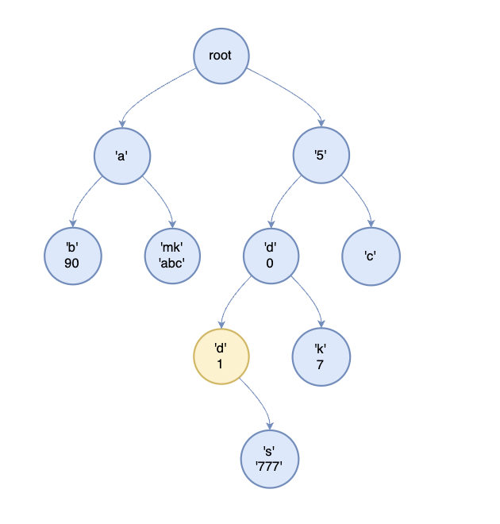
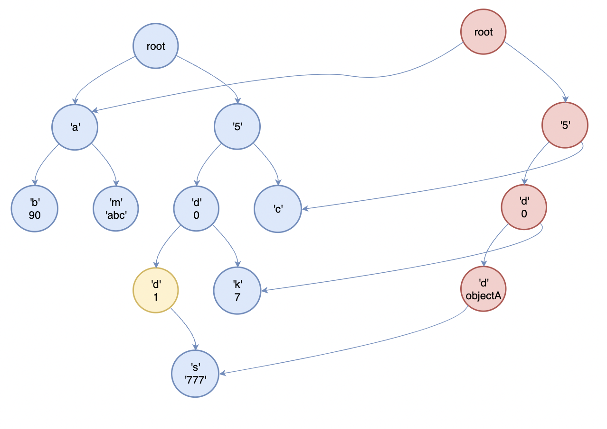
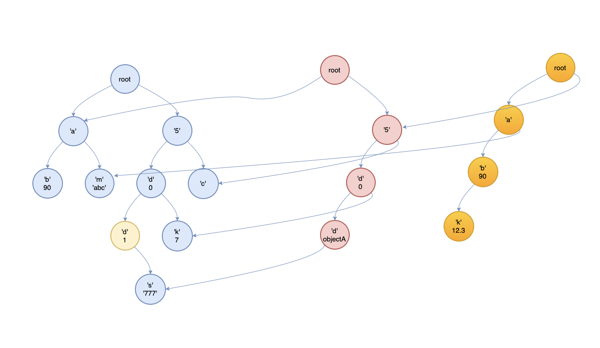
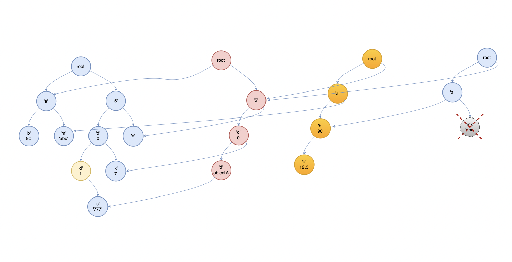

# 整体思路

## 版本思想
主要需要明确多个version的思想。get操作不会数据进行修改，因此不会新增版本。对于修改和新增操作，会修改数据。为了获得每次操作前的历史数据，要记录各个version。

最简单的方式就是每次都从root开始复制一份新的trie，在新的root上进行修改。但这样做会很耗时间。因此会采用copy-on-write的思想。每次尽可能地去共享节点,只新建**不能共享的节点**。可以验证,对于修改操作,**不能共享的节点**为目标节点及其所有路径上的父节点。对于新增操作,**不能共享的节点**为目标节点及其所有路径上的父节点。

删除操作会删除key所对应的value,原理上与修改/添加是类似的，还需要额外注意几点:

1. 删除是删除value,而不是node。删除value后,node要降级为普通的TrieNode。
2. 对于被删除value的node,如果node没有任何children了,那么该node其实已经废了，需要被删除
3. 递归过程中,只要某个节点是普通的TrieNode节点,而且没有任何children了,都需要将该节点删除。

## 修改

 

如图，我们要修改标黄的节点。那么需要新生成的节点为 root->'5'->'d'(0)->'d'(1). 其它节点共享

## 新增

在 root->'a'->'b'(90)后新增'k'(12.3)

## 删除

# 注意事项