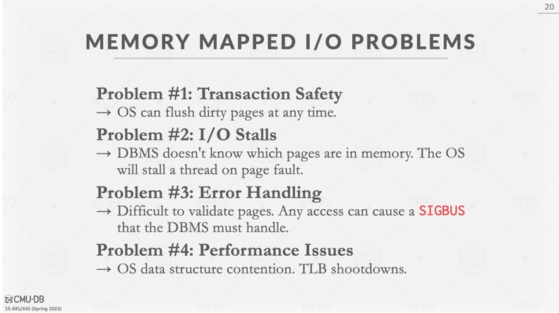

# 注意事项

## mmap

由操作系统来管理进程的虚拟内存和实际file的映射。但有几个问题

最显然的是缺页中断。如果进程在需要获取数据时，数据不在内存中(还没有打开，或者被swap了)，就会发生缺页中断,造成进程的阻塞

## OS Page Cache

## Page vs Frame

首先,page(disk中也可以称作block,chunk)指的是一块连续的4k,或者8k的存储空间. 可以在disk上,也可以在memory上。对于操作系统来说,page是最小的数据管理单元，从磁盘中一次性最少读出page大小的连续数据。对于数据库来说,它的一个page size可以和disk page size相同,比他大,或者比他小。在这个15445中,professor为了简化问题，一般说db的page为4k。在数据库管理的disk数据空间中, 每个page都有一个page_id，从0开始。

Frame 是buffer pool manager 中的概念。每个Frame都能handle一个page，用于管理其元数据、pin的状态、data。每个Frame有一个frame_id，从0开始。

不论是page_id还是frame_id，它们都是相对概念，或者说是抽象概念。page_id是针对db管理的disk数据空间来命名的,即0,1,2,3.....

## Page 的具体内容
